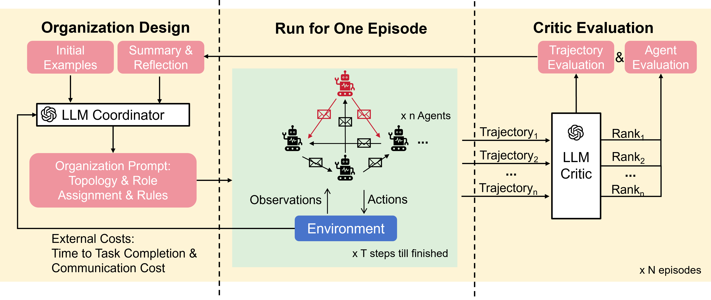

# Embodied LLM Agents Learn to Cooperate in Organized Teams
Source codes for the paper:

*Guo, Xudong, Kaixuan Huang, Jiale Liu, Wenhui Fan, Natalia Vélez, Qingyun Wu, Huazheng Wang, Thomas L. Griffiths, and Mengdi Wang*: **Embodied LLM Agents Learn to Cooperate in Organized Teams**

[Paper](https://arxiv.org/abs/2403.12482)

In this repo, we implement embodied and organized multi-LLM-agent teams in the environment [VirtualHome](https://github.com/xavierpuigf/virtualhome) to cooperate on household tasks. The agents can **make decisions** and **communicate freely** with each other based on LLMs. The codes support multi-agent communication (**>3 agents**) such as broadcasting, keeping silent, and selecting receivers to send distinct messages.


Thanks to the flexible communication protocol, the **organizational structures** can be updated accordingly and autonomously by editing the organization prompts. The agents show **emergent cooperative behaviors** such as information sharing, leadership & assistance, and requests for guidance.


To improve the organization prompts, we propose the *Criticize-Reflect* architecture based on LLMs to analyze the trajectories and reflect on the feedback to generate novel prompts.



## Installation

Clone the [VirtualHome API](https://github.com/xavierpuigf/virtualhome.git) repository:

```bash
git clone --branch wah https://github.com/xavierpuigf/virtualhome.git
```

Download the [Simulator](https://drive.google.com/file/d/1JTrV5jdF-LQVwY3OsV3Jd3r6PRghyHBp/view?usp=sharing) (Linux x86-64 version), and unzip it.

The files should be organized as follows:

```bash
|--cwah/
|--virtualhome/
|--executable/
```

## Experiments
Set up your API keys or local LLM models in /envs/cwah/scripts
/llm_configs.json
```
"gpt-4" : 
    {
        "api_key": "API_KEY",
        "model": "gpt-4"
    }
```

Add your organization prompts in /envs/cwah/testing_agents
/organization_instructions.csv

For example, 
```
Agent 1 is the leader to coordinate the task.
```


To run the experiment with a fixed organization prompt:
```
bash envs/cwah/scripts/fixed_organization.sh
```

To improve the organization prompt by *Criticize-Reflect*:
```
bash envs/cwah/scripts/criticize_reflect.sh
```

Check the logs and the visualization of communication in the folder envs/cwah/log


Other core files:

Interface between agents and envs: envs/cwah/algos/arena_mp2.py

Communication module based on AutoGen: envs/cwah/algos/comms.py

LLM agent: envs/cwah/agents/LLM_agent.py

LLM and prompts: envs/cwah/LLM/LLM.py

## Citation
```
@article{guo2024embodied,
  title={Embodied LLM Agents Learn to Cooperate in Organized Teams},
  author={Guo, Xudong and Huang, Kaixuan and Liu, Jiale and Fan, Wenhui and V{\'e}lez, Natalia and Wu, Qingyun and Wang, Huazheng and Griffiths, Thomas L and Wang, Mengdi},
  journal={arXiv preprint arXiv:2403.12482},
  year={2024}
}
```

## Acknowledgements
Our work is based on the repos: [Co-LLM-Agents](https://github.com/UMass-Foundation-Model/Co-LLM-Agents) and [AutoGen](https://github.com/microsoft/autogen)
